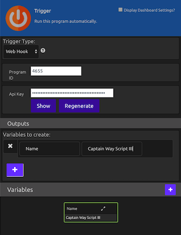

# WayScript Ajax to Python Example

WayScript allows you to execute python scripts and recieve results back via an AJAX request. In this example, we use a Node server to run a WayScript program and recieve the results back. 

## Setup Node Application

If you don't already have it installed, install node: https://nodejs.org/en/

To Run The Server Enter:
```
nodemon app.js
```


If running properly, you should see: "WayScript Ajax Example Running" in your terminal.

In your browser go to http://127.0.0.1:8081

## Setup Wayscript Program

1) If you don't have one already, register for a WayScript account
```
https://wayscript.com/
```
2) Create a New Program


3) Drag in the 'Trigger' Module from Logic
      - Set the Mode to 'Webhook'
      - Create a Variable Called 'Name' and give it a default name (i.e. Captain Way Script III ).
      
      




## Run App
