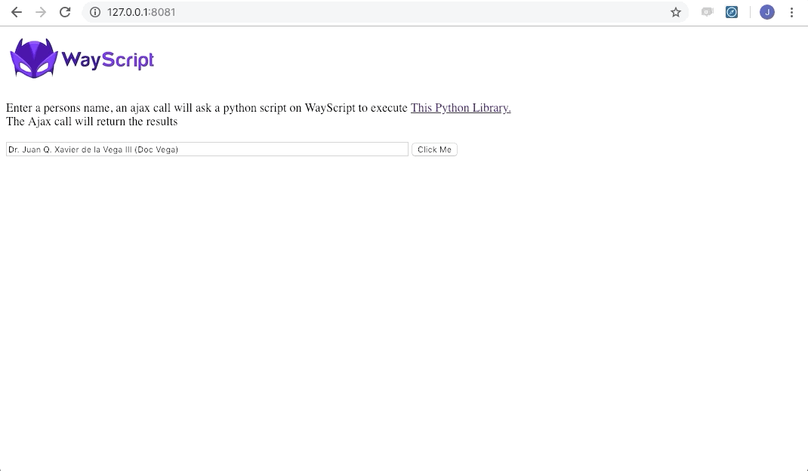

# WayScript Ajax to Python Example

WayScript allows you to execute python scripts and recieve results back via an AJAX request. In this example, we use a Node server to run a WayScript program and recieve the results back. 

In this example, a user can submit a name via a node server, and the data is passed to a python script that executes the 
<a href="https://github.com/derek73/python-nameparser">Name Parser</a> library. The results are returned to the Node Server in real time. 

## Setup Node Application

If you don't already have it installed, install node: https://nodejs.org/en/

In the app root directory, type
```
npm install 
```

To Run The Server Enter:
```
node app.js
```
If running properly, you should see: "WayScript Ajax Example Running" in your terminal

In your browser go to http://127.0.0.1:8081

## Setup Wayscript Program

1) If you don't have one already, register for a WayScript account
```
https://wayscript.com/
```
2) Create a New Program


3) Drag in the 'Trigger' Module from Logic.
      - Set the Mode to 'Webhook'.
      - In the Outputs section of the Trigger Module, create a Variable Called 'Name' and give it a default name (i.e. Captain Way Script III )
      
      


4) Drag in the Python Module as your next step
      - Select your Name variable under Inputs


5) Copy and Past your Python Script into the CodeBox
```
#https://github.com/derek73/python-nameparser
from nameparser import HumanName

name = inputs[ 'Name' ]

name = HumanName( name )

outputs[ 'Title' ] = name.title
outputs[ 'First Name' ] = name.first
outputs[ 'Middle Name' ] = name.middle
outputs[ 'Last Name' ] = name.last
outputs[ 'Suffix' ] = name.suffix
outputs[ 'Nick Name' ] = name.nickname
```


6) Set your outputs to return via the Ajax Request
      - On the top of the Python Module, click "Display Dashboard Settings"
      - Next to Each Output (Scroll Down in the Python Module) click "Show on Dashboard"
      -You have now set each output to return via the Webhook


## Run App

1) Open your app.js file and input your Program ID and API Key into the file.


2) Press The Run Button and the program executes the Python code and returns the results to your Node Server!


