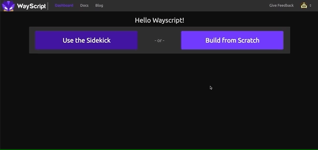

# WayScript Ajax to Python Example

## Setup Node Application

If you don't already have it installed, install node: https://nodejs.org/en/

To Run The Server Enter:
```
nodemon app.js
```

If running properly, you should see: "WayScript Ajax Example Running" in your terminal.

In your browser go to http://127.0.0.1:8081

## Setup Wayscript Program

1) If you don't have one already, register for a WayScript account
```
https://wayscript.com/
```
2) Create a New Program
```

```
## Run App
